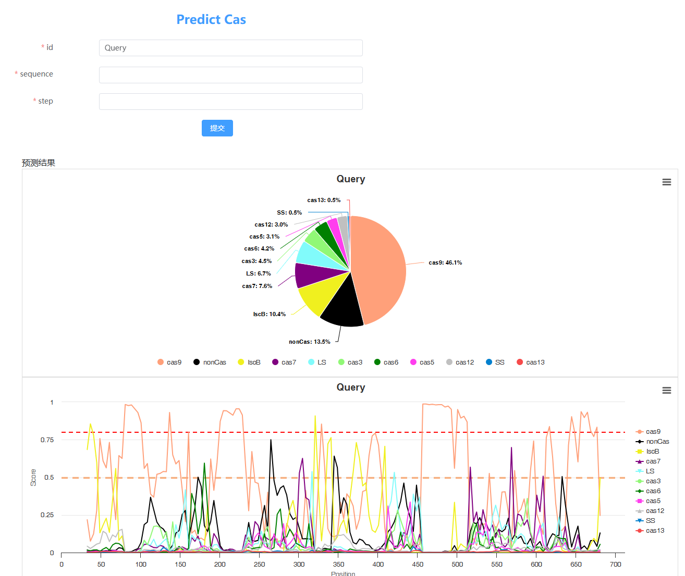

# **Cas-Detector**

This repository is part of a B-S structured project aimed to detect local Cas-like signals in user-uploaded amino acid sequences. Only the sequence and a sliding-window step size should be designated.

Outputs are like:

Where a dominant in Cas type indicates the phylogeny of the input. Sub areas where a dominance is missing indicates homologous domains across multiple Cas types. This provide us the information of domain-based evolution across Cas effectors.